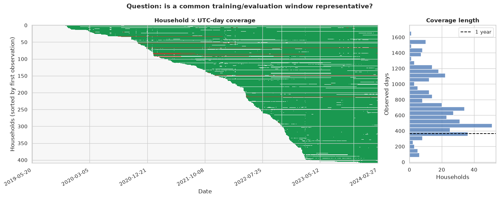
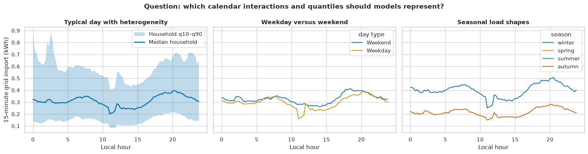
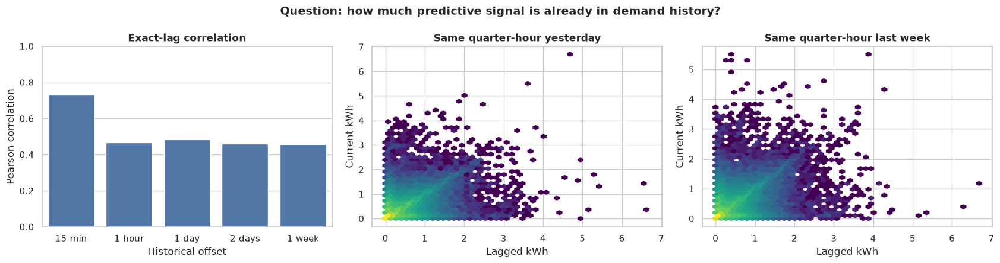
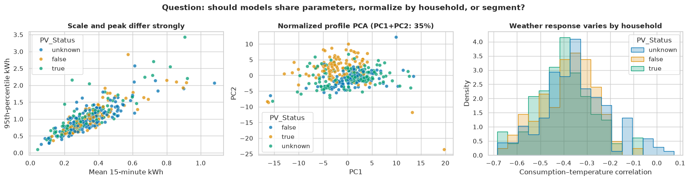
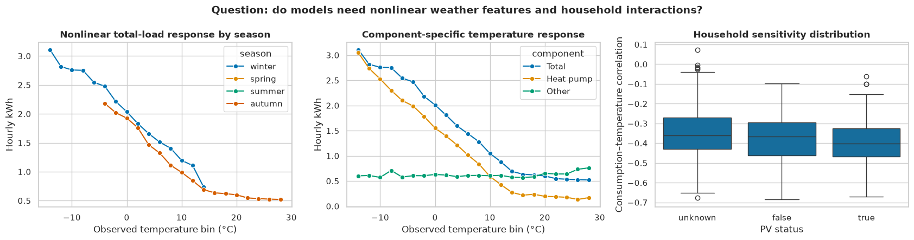
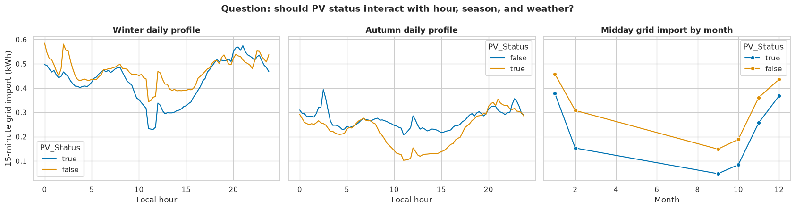
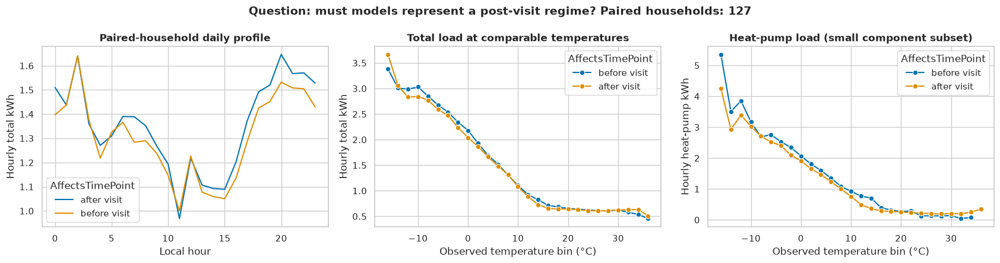
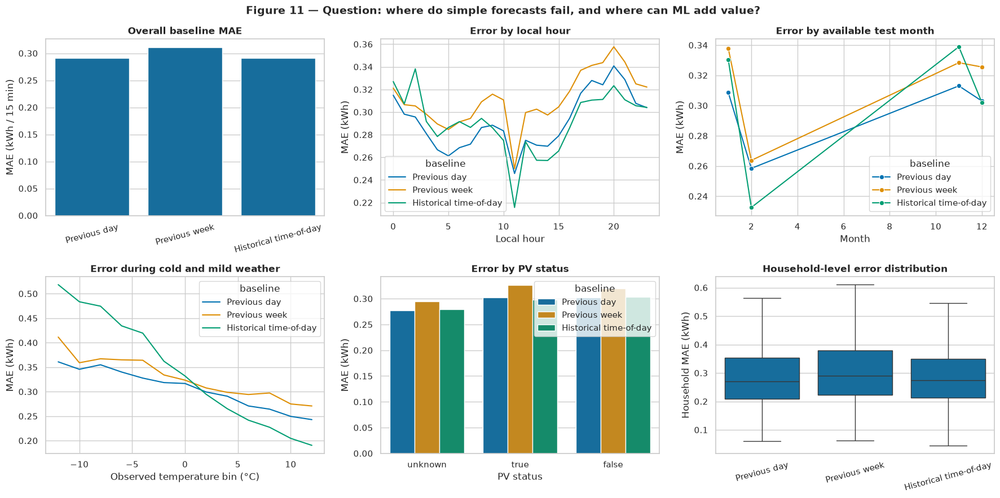

# Forecasting Insights from the EDA

Source: [`notebooks/01_data_eda.ipynb`](../notebooks/01_data_eda.ipynb)

## Executive summary

The data support moving from exploration to an initial forecasting benchmark, but they do not yet justify selecting a final model. The strongest candidate is a **global, household-aware gradient-boosted model** that predicts the complete 96-step day directly and uses calendar effects, origin-safe demand history, household/PV metadata, and forecast-weather covariates.

The main conclusions are:

1. The measured target is **grid import**, not total consumption or PV generation.
2. Household histories and missingness differ substantially, so exact timestamp alignment and explicit availability rules are essential.
3. Demand has strong short-term structure, but daily and weekly persistence alone leave substantial error.
4. Temperature has a strong nonlinear effect, driven mainly by heat-pump consumption.
5. Households differ strongly in scale, peaks, shape, and weather sensitivity, without forming clean clusters.
6. PV status, intervention state, hour, and weather interact; none should be interpreted through raw marginal averages alone.
7. Procurement performance must ultimately be evaluated at portfolio level, not only per household.

## Important scope and interpretation limits

- `kWh_received_Total` measures energy received from the grid. The data contain no PV-production or grid-export signals.
- The stable analysis cohort contains 354 households with at least 95% complete hourly data in the final 180 days.
- That common period runs from September 2023 through February 2024. Seasonal conclusions therefore mostly concern autumn and winter.
- The baseline test covers the final 90 days and is consequently dominated by winter behavior.
- Realized target-day weather is useful for diagnosing potential signal, but is not a valid production feature. Operational backtesting requires the weather forecast available at each historical forecast origin.
- The working assumption is that all 96 intervals of day D are forecast at 00:00. The actual bidding cutoff must be confirmed.

## 1. Coverage and data quality affect the forecasting design

The dataset contains 28,180,608 quarter-hourly rows from 410 households, with no duplicated household timestamps. However:

- 517,536 existing rows have a missing target value.
- There are 1,691 omitted timestamp blocks.
- The median omitted block is one day; the longest is 351 days.
- Only 288,157 of 293,548 observed UTC days contain all 96 valid target values.
- Household start dates and total history lengths differ markedly.

### Forecasting implication

- Construct lags with exact `(Household_ID, timestamp)` joins, never positional row shifts.
- Retain missingness and availability indicators.
- Report prediction coverage alongside error metrics.
- Evaluate both the reliable common cohort and a broader cohort to quantify selection bias.
- Define whether the procurement portfolio is fixed or can change as meters become unavailable.

The extreme observed value of 66.976 kWh in one 15-minute interval also warrants meter-domain verification. It should be flagged, not automatically removed.

## 2. The target has strong calendar structure and household dispersion

The typical profile has an evening peak, weekday/weekend differences, large cold-season level changes, and very broad cross-household quantile bands.

The pronounced late-morning discontinuity is especially noteworthy. It appears across several aggregate profiles and may reflect a heat-pump control schedule, tariff rule, intervention behavior, or another operational mechanism. It should be investigated by household, group, and weather station before treating it as ordinary smooth seasonality.

### Forecasting implication

Use:

- quarter-hour and hour-of-day encodings;
- weekday/weekend and month/season features;
- hour × weekday and hour × season interactions;
- horizon-specific behavior across the 96 day-ahead steps;
- household identity or household-level static features.

A model with a single smooth daily seasonal term is unlikely to capture the sharp scheduled behavior.

## 3. Demand history is useful, but seasonal persistence is not sufficient

The exact lag analysis gives:

| Historical offset | Correlation | Persistence MAE |
|---|---:|---:|
| 15 minutes | 0.732 | 0.162 kWh |
| 1 hour | 0.468 | 0.249 kWh |
| 1 day | 0.483 | 0.239 kWh |
| 2 days | 0.459 | 0.249 kWh |
| 1 week | 0.458 | 0.254 kWh |

The 15-minute relationship is strongest, but it is not directly available for every point in a one-shot 96-step forecast. Using it recursively would feed predictions back into the model and accumulate error. Same-time-yesterday and same-time-last-week are weaker but operationally safer at a midnight origin.

### Forecasting implication

- Include the previous-day and previous-week 96-step blocks.
- Include recent history available before the forecast origin and past-only rolling statistics.
- Prefer a direct 96-step forecast over a fully recursive 15-minute forecast.
- Keep previous-day and previous-week persistence as mandatory baselines.

## 4. Household differences are continuous rather than cleanly clustered

Households differ greatly in mean demand, peak demand, normalized load shape, and temperature response.

PCA shows overlapping rather than clearly separated profile groups. K-means silhouette scores are only about 0.23–0.26 for two to six clusters.

### Forecasting implication

Start with a global model that shares information while retaining household identity and static covariates. Household-level normalization may help some model classes. Hard cluster-specific models are not currently supported strongly enough by the data.

## 5. Temperature is the dominant external driver

Grid import increases sharply and nonlinearly in cold weather. The component analysis shows that the relationship is driven primarily by heat-pump demand, while other consumption remains comparatively flat.

The strength of temperature sensitivity also differs materially between households.

### Forecasting implication

Test:

- forecast temperature;
- nonlinear temperature transforms;
- heating-degree features such as `max(15°C − temperature, 0)`;
- temperature × hour and temperature × household interactions;
- recent temperature history to represent building thermal inertia.

Every weather-enabled result should be compared with a no-weather model and, if only realized weather is available, labelled as an oracle upper bound.

## 6. PV ownership changes the grid-import profile

Known PV households generally show lower midday grid import, with the difference varying across the available months and seasons.

This is consistent with behind-the-meter self-consumption, but it is not direct evidence about PV production. Moreover, PV status is unknown for 165 households.

### Forecasting implication

- Keep PV status as `true`, `false`, or `unknown`.
- Test PV × hour, PV × season, and PV × sunshine interactions.
- Do not impute unknown PV labels as non-PV.
- Do not claim to forecast generation unless generation/export data become available.

## 7. Intervention effects are smaller after controlling for temperature

The paired-household raw profiles differ before and after the optimization visit. Once demand is compared at similar outdoor temperatures, total-demand curves become much closer. The smaller component subset suggests reduced heat-pump use after the visit at colder temperatures, but the evidence is not sufficient for a causal claim.

### Forecasting implication

- Treat intervention state as a possible regime indicator, not proof of savings.
- Use it only if visit status is genuinely known at forecast issuance.
- Compare pre- and post-intervention forecast errors explicitly.
- Consider separate calibration or recent-history weighting if a clear post-visit distribution shift remains.

## 8. Baselines reveal the regimes where ML can add value

Overall household-level results are:

| Baseline | MAE | WAPE | Bias: actual − forecast |
|---|---:|---:|---:|
| Previous day | 0.2917 kWh | 65.43% | -0.0019 kWh |
| Previous week | 0.3112 kWh | 69.83% | -0.0094 kWh |
| Historical time-of-day | 0.2913 kWh | 65.36% | +0.1942 kWh |

The historical average has marginally lower MAE but substantial underforecasting bias. Previous-day persistence is the more credible operational baseline.

Errors increase during:

- very cold weather;
- evening demand peaks;
- some PV-household regimes;
- a subset of difficult, high-variability households.

### Forecasting implication

These are the regimes in which nonlinear weather effects, household conditioning, and calibrated uncertainty should provide the most value. They should also be explicit evaluation slices rather than observations made only after a final model is selected.

The reported WAPE is household-level. Portfolio aggregation should be evaluated separately because independent household noise may cancel and substantially reduce procurement error.

## Recommended model ladder

### Stage 0 — Required baselines

1. Previous day
2. Previous week
3. Historical same-time-of-day mean
4. A fitted linear combination of daily and weekly persistence

### Stage 1 — Interpretable global benchmark

Fit a regularized global linear model with:

- exact seasonal lags;
- past-only rolling summaries;
- cyclic calendar encodings;
- forecast temperature/heating-degree terms;
- household, PV, and intervention features where valid.

This establishes how much value comes from feature engineering before nonlinear modelling.

### Stage 2 — Primary candidate

Fit a global LightGBM, XGBoost, or CatBoost model with a direct 96-step output strategy. This is the best match for the observed nonlinear temperature response, calendar interactions, missingness, and household heterogeneity.

Within Darts, use an output chunk of 96 so the requested day is generated in one shot rather than by recursively consuming predicted targets.

### Stage 3 — Portfolio comparison

Compare:

- a model trained directly on aggregate portfolio demand;
- household forecasts summed into a portfolio forecast;
- optionally, a hybrid or reconciled forecast.

Procurement conclusions should be based primarily on portfolio MAE, WAPE, bias, peak/cold-period error, and an asymmetric imbalance-cost simulation.

### Stage 4 — Uncertainty

After selecting the point model, add:

- quantile gradient boosting, or
- conformal intervals calibrated only on rolling-origin residuals.

Check calibration by horizon, temperature regime, and household scale. Cold-weather and evening intervals are likely to require wider uncertainty bands.

### Focused component experiment

For the 17 households with complete decomposition, compare:

1. a direct total-demand model; and
2. separate heat-pump and other-demand models whose predictions are summed.

The exact decomposition makes this scientifically coherent, but the limited household count means it should remain a focused experiment rather than the main solution.

## Validation requirements

- Use daily rolling forecast origins and a complete 96-step horizon.
- Fit normalization, imputation, PCA, and feature selection inside each training fold.
- Construct every demand feature relative to the common forecast origin.
- Use archived forecast weather or report realized weather as an oracle experiment.
- Report household macro metrics and portfolio metrics separately.
- Include MAE, WAPE, RMSE, bias, prediction coverage, and procurement-weighted cost.
- Report errors by horizon, hour, temperature, PV status, intervention state, and household.
- Evaluate a broader seasonal period before generalizing the current autumn/winter findings.

## Recommended immediate experiment

Run the following controlled comparison on identical rolling origins:

1. Previous-day persistence
2. Regularized global linear regression
3. Global gradient boosting with calendar and origin-safe demand history
4. The same gradient-boosting model with forecast-weather features
5. Quantile or conformal version of the best point model

This sequence is small enough for the hackathon, directly tests the hypotheses supported by the EDA, and creates a clean handoff from forecasting to UQ and procurement optimization.
